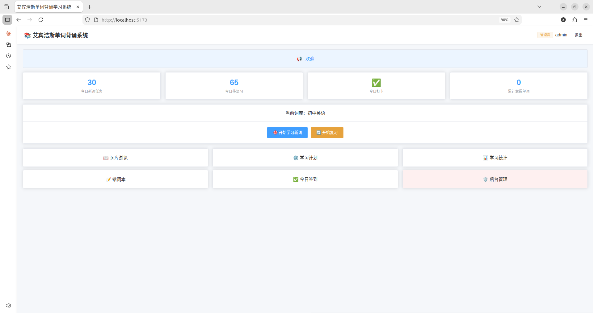
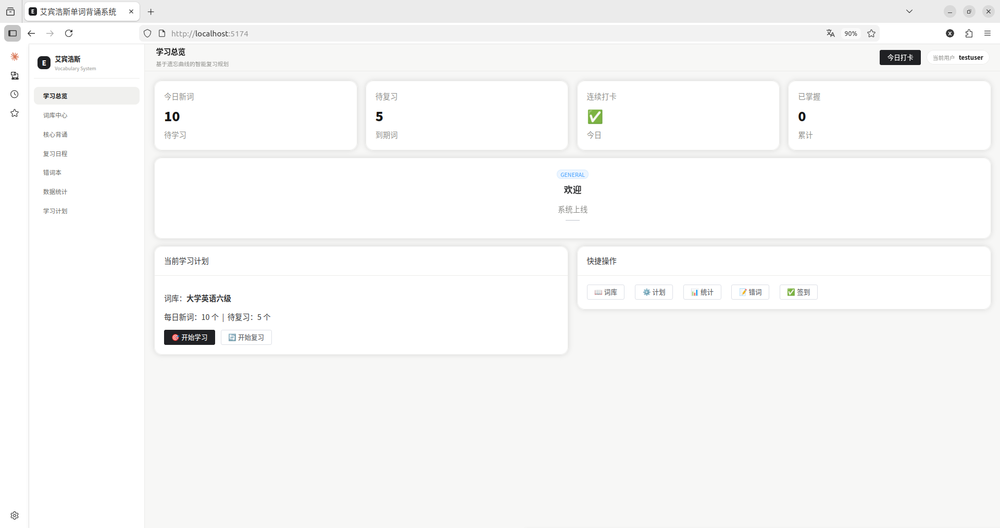
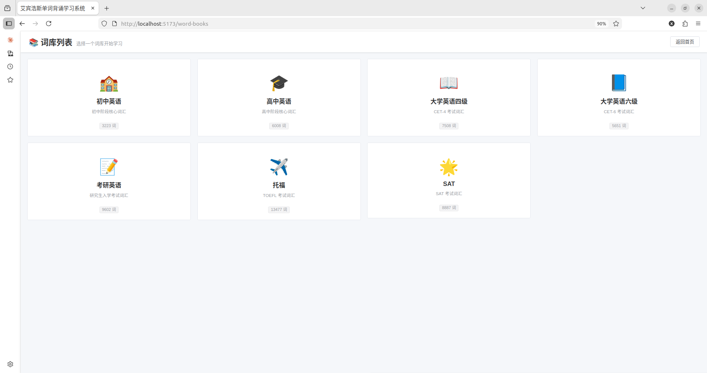
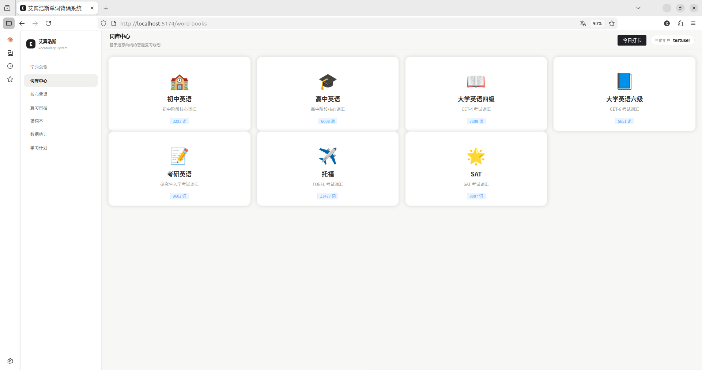
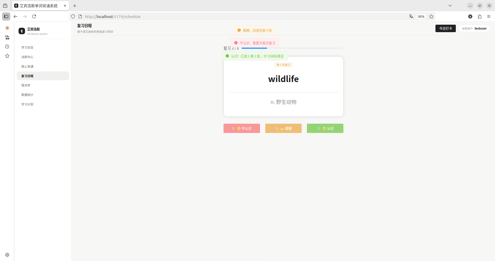
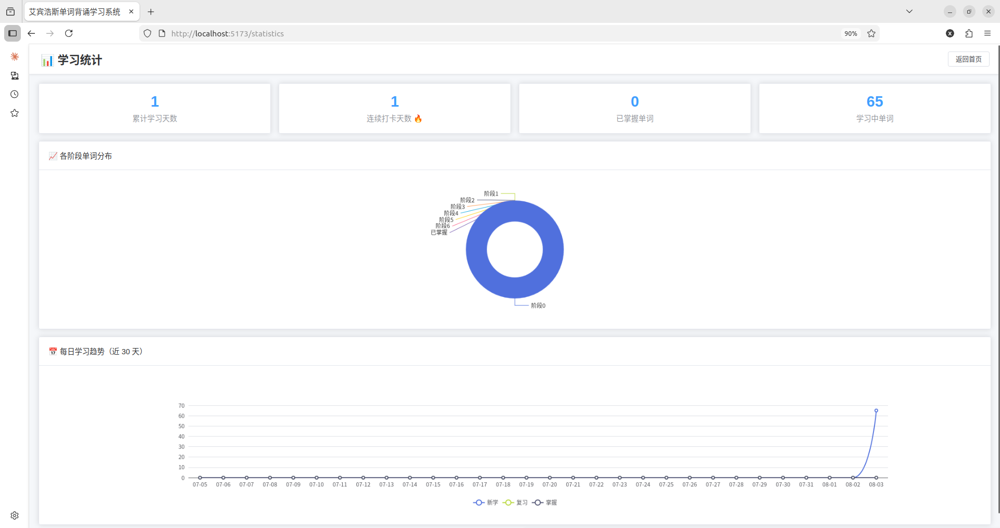
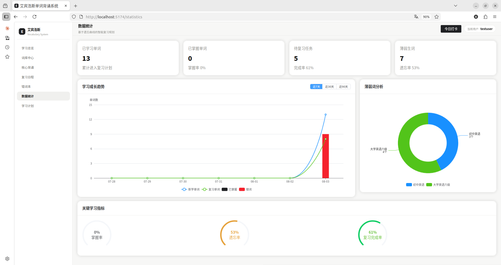

# 艾宾浩斯单词背诵系统

> 这不是一个"我做了个单词 App"的项目。这是一个关于 **AI 时代怎么开发软件** 的对比实验。

## 背景

在做扩散模型科研项目的过程中，我尝试让 AI Agent 协助实现实验代码。需求讲清楚了，要求也给了，但 AI 产出的结果总是不可控——我不清楚它是怎么得到这个结果的、不确定它是否真的按我的要求做了、往往要花额外时间去理清它到底做了什么。最糟糕的是，理清之后发现它的实现方法偏离了我的需求，只能重来。

后来我才知道，这个问题在 2025 年有了一个名字——**Vibe Coding**。Andrej Karpathy 提出的这个词描述的正是"通过自然语言描述需求，让 AI 生成代码"的模式。行业很快发现了它的代价：Cursor CEO 称之为"代码高利贷"——开发快 10 倍，维护成本高 100 倍。谷歌云 AI 总监 Addy Osmani 的结论更直接——"Vibe Coding 已撞南墙。AI 能搞定前 70%，剩下 30% 只有经验丰富的工程师能完成。"

我在网上看到了不少人在讨论应对方法，其中一套思路引起了我的注意——**SDD（Spec-Driven Development，规范驱动开发）**：在写任何一行代码之前，先出 Specs → Design → Tasks，然后按 Tasks 逐项让 AI 实现，人在每一轮中审查和反馈。规范是合同，代码是履约。GitHub 开源的 Spec Kit 已经有接近十万星，OpenSpec 也有五万多星——但这个方法论本身还在早期阶段，Thoughtworks 的技术雷达把它放在"评估"环而非"采纳"环，尚未成为行业标准。

我想验证一下这套方法到底行不行，但不想直接拿科研项目冒险。我需要一个功能边界清晰的 Web 系统作为对照实验的载体。于是有了这个仓库——同一套 SDD 文档，两次开发。唯一变量：**人有没有参与迭代**。

## 实验设计

| | v1（`v1-sdd-only/`） | v2（`v2-polished/`） |
|---|---|---|
| **开发方式** | AI 按文档独立完成，人不碰代码 | AI 写 → 人测 → 人反馈 → AI 改 → 循环 |
| **任务数** | 55 项 | 60 项（含 UI 风格统一） |
| **迭代轮次** | 0（一次通过） | 每项 Task 逐轮打磨 |
| **Bug 修复** | — | 14 项 |
| **体验优化** | — | 11 项 |
| **词库数据** | 159 个示例词 | 54,356 个真实词 |

**一样的 Specs。一样的 Design。结果天差地别。**

## 快速对比

| | v1（纯 SDD） | v2（人机协作） |
|---|---|---|
| 首页 |  |  |
| 词库 |  |  |
| 复习 |  |  |
| 统计 |  |  |

## SDD 解决了什么

对比一下没有 SDD 之前我在科研项目里踩的坑和这次 v1 的结果——

| | 没有 SDD（以前） | 有 SDD（v1） |
|---|---|---|
| AI 理解需求 | 靠对话描述，AI 猜着做，不知道它理解到哪了 | Specs 写了验收标准——"做到什么程度算完"不靠猜 |
| 偏离需求 | 做完了才发现方向不对，重来 | Tasks 拆小，每步做完对照 Specs 检查——偏离及时发现 |
| 上下文膨胀 | 反复纠正，对话越来越长，AI 越改越乱 | 每个 Task 一次只做一件事，上下文干净 |
| 功能完成度 | 不确定哪些做了、哪些漏了 | Specs 的每条验收标准都通过了——功能都在 |

**SDD 确实解决了 Vibe Coding 最核心的"失控"问题。** v1 就是证据——AI 独立完成，55 项任务全部通过，功能正确。

## v1 和 v2 的差距说明了什么

但 v1 离"能用"还差一口气。差的那口气不是高深技术——是那些你坐在浏览器前真正用了一遍之后才会发现的东西。按钮没有颜色区分，点完之后不知道成功了没有，不小心操作了没有撤销。

这不是 SDD 的问题。这是 AI Agent 当前能力的边界——它可以在有明确验收标准的情况下保证功能正确，但它做不到"假设自己是用户，用了一遍之后发现这里体验不好"。**体验判断需要人的参与，至少在 2026 年是这样。**

v2 修复了 14 个 Bug、完成了 11 项体验优化。（完整清单见 [v2 README](./v2-polished/README.md)）

## 两个版本均可独立运行

各目录内 README 包含完整启动步骤。

```
git clone https://github.com/11111XIMOLOKO/ebbinghaus-vocab-system.git
cd ebbinghaus-vocab-system/v1-sdd-only   # 或 v2-polished
```

## SDD 文档

[`sdd/`](./sdd/) 目录包含完整设计产出——Specs + Design + Tasks + CLAUDE.md + STATUS。所有文档与代码实际行为完全对齐。

## 我学到了什么

**写清楚需求本身就是一种能力。** 大多数人跟 AI 说"帮我做一个 XX"。你把需求拆成了 60 项任务——不是因为 AI 需要这么多细节，是因为你自己想清楚了。

**AI 不是自动驾驶，是副驾驶。** 代码是 AI 写的，但架构你定、验收标准你给、每一轮迭代的体验你判断。你是那个知道"什么算好"的人。

**这套方法论迁移到了科研。** 同样的 SDD 方法 + 人机协作节奏，正在用于扩散模型工业缺陷检测 Pipeline 的开发。

## 仓库结构

```
├── README.md
├── sdd/                        # SDD 文档
├── v1-sdd-only/                # 对照组：纯 SDD 生成
├── v2-polished/                # 实验组：人机协作精修
└── docs/screenshots/           # 对比截图
```
